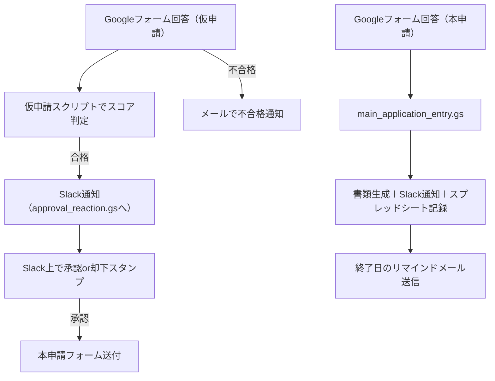

# 🚚 キッチンカー申請管理自動化システム（Google Apps Script）

このリポジトリは、大学のサークルが運営するキッチンカー出店申請プロセスのすべてを Google Apps Script で自動化したものです。個人・団体による仮申請の審査、本申請の受付、Slack を使った承認フロー、リマインド通知、カレンダー登録、PDF 自動生成・メール送信まで、申請処理の全工程を一括で管理します。

---

## 📌 構成ファイル概要

| ファイル名                  | 役割                                                                                         |
| --------------------------- | -------------------------------------------------------------------------------------------- |
| `approval_reaction.gs`      | Slack スタンプによる申請の承認／却下フロー（リアクションイベント監視）                       |
| `pre_application_check.gs`  | 仮申請フォーム（テスト結果）に基づく合否判定＋通知・書類生成処理                             |
| `main_application_entry.gs` | 本申請フォーム（出店日程）からの情報をもとに、書類生成・リマインド処理を行うメインスクリプト |

---

## 🔄 全体フロー図（概要）

---

## ✅ 主な機能一覧

### 🧪 1. 仮申請審査スクリプト（pre_application_check.gs）

- Google フォームで受け取ったスコア・食品衛生責任者・クイズ内容に基づき自動合否判定
- 合格者のみ Slack 通知（申請情報付き）
- 不合格者には自動メール送信＆行のグレー化

### ✅ 2. Slack 承認リアクションスクリプト（approval_reaction.gs）

- Slack 上の指定メッセージに対するリアクション（:cs*マル: / :cs*バツ:）を監視
- 指定の 2 種スタンプがそろったら「承認」、どちらかがバツなら「却下」と判定
- スプレッドシート行の色変更、メール送信（合格者のみ）

### 📝 3. 本申請受付・書類生成スクリプト（main_application_entry.gs）

- 本申請フォーム（団体／個人）の自動判定
- Google ドキュメント・スプレッドシートのテンプレート複製と自動記入
- Google カレンダー登録（時間付き or 終日イベント）
- Slack 通知（外部スクリプトへ）
- スプレッドシート「リマインド」シートに通知対象情報を記録
- リマインド期日到達時に、Slack とメールで自動通知

---

## 🔐 スクリプトプロパティ（必要な環境変数）

| キー名                       | 説明                                                              |
| ---------------------------- | ----------------------------------------------------------------- |
| `SLACK_TOKEN`                | Slack API 用 Bot トークン                                         |
| `WEBHOOK_URL`                | Slack 通知用 Webhook の URL（またはスクリプト Web App URL）       |
| `CHANNEL_ID`                 | 通知を送る Slack チャンネル ID                                    |
| `TEMPLATE_DOC_ID`            | 団体用テンプレートドキュメントのファイル ID                       |
| `INDIVIDUAL_TEMPLATE_DOC_ID` | 個人用テンプレートドキュメントのファイル ID                       |
| `TEMPLATE_SHEET_ID`          | タイムスケジュール＆持ち物リストのテンプレートスプレッドシート ID |
| `DESTINATION_FOLDER_ID`      | 仮申請の合格者用ドキュメント保存先フォルダ                        |
| `PARENT_FOLDER_ID`           | 本申請のフォルダ保存用の親フォルダ ID                             |
| `CALENDAR_ID`                | キッチンカーイベント登録先カレンダー ID                           |
| `UNIVERSITY_EMAIL`           | 提出先（大学側）のメールアドレス                                  |
| `ADMINISTRATOR_EMAIL`        | 責任者のメールアドレス                                            |
| `SUBMISSION_FORM_URL`        | 本申請後の提出書類用フォーム URL                                  |

---

## 🧰 使用技術

- **Google Apps Script**
  - `SpreadsheetApp`、`DocumentApp`、`DriveApp`、`CalendarApp` など
- **Slack API**
  - `chat.postMessage`, `reaction_added` / `reaction_removed` の WebHook 対応
- **Google Calendar API**
- **Google Drive API**

---

## 🛠️ 導入方法（概要）

1. 各スクリプトファイルを Google Apps Script エディタにコピー
2. トリガーを以下のように設定：
   - `onFormSubmit`（仮申請 / 本申請）→ フォーム送信時
   - `doPost` → Web アプリ公開（Slack 連携用）
   - `sendReminderToSlack`, `endEmail` → 毎日定期実行
3. スクリプトプロパティに必要な情報を設定
